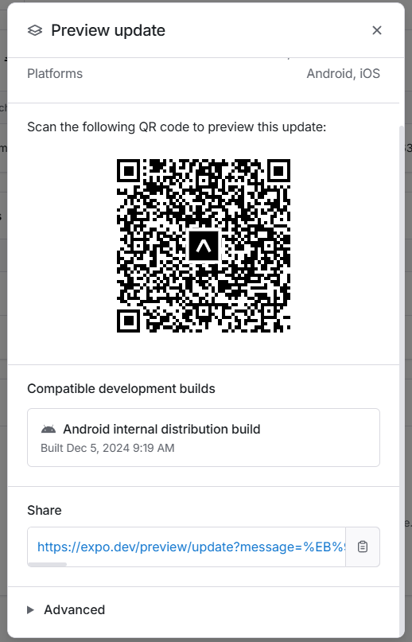
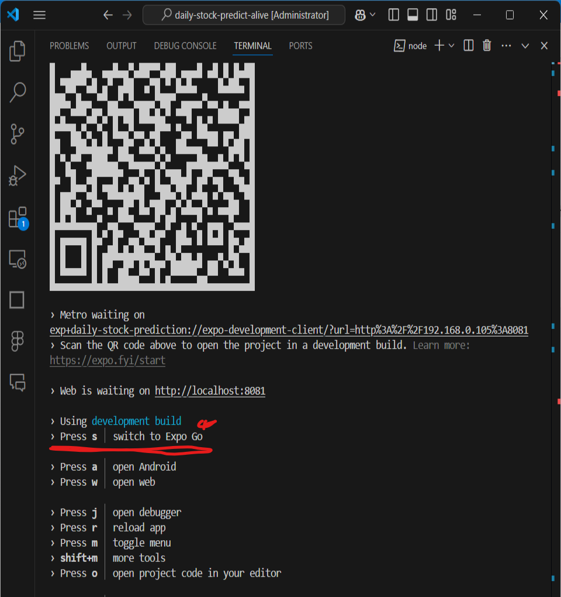
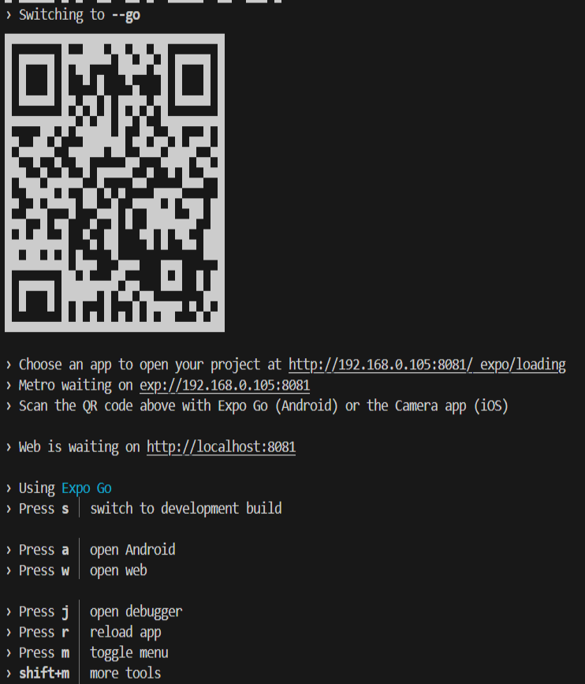
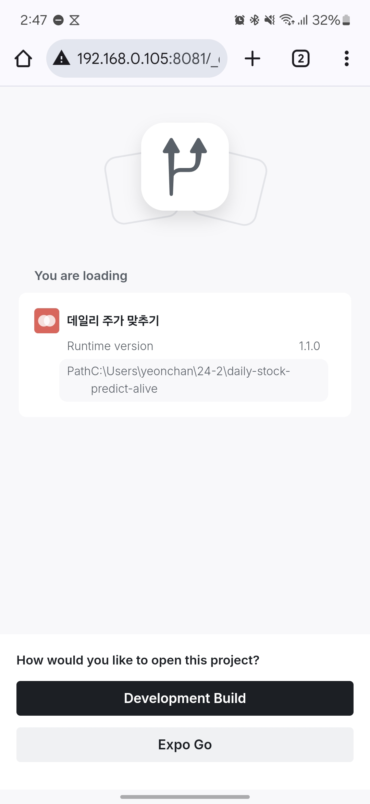

## README

### 📱 데일리 주가 맞추기

매일 특정 종목의 주가가 오를지, 내릴지를 예측하며 즐기는 간단한 금융 게임 앱입니다.

---

### 🔑 주요 기능

1. **홈 화면**

   - 사용자의 현재 점수와 남은 시간을 표시
   - 주식을 선택해 예측 화면으로 이동 가능

2. **결과 보기**

   - 사용자의 점수와 성과를 시각화된 차트로 확인 가능
   - 성과별 랭킹 제공

3. **예측 화면**

   - 선택한 종목의 최근 주가 데이터를 기반으로 상승/하락 예측
   - 실시간 주가 차트와 뉴스 조회

4. **뉴스**

   - 선택한 주식과 관련된 최신 뉴스를 제공

5. **랭킹**

   - 전체 사용자 랭킹 확인 및 자신의 위치 표시

6. **멀티 차트**
   - 여러 주식의 최근 주가 데이터를 한 화면에서 비교 가능

---

### 🚀 설치 및 실행

### expo go 앱으로 실행만 원하는 경우

expo go 앱 설치 후 ,





위 qr를 스캔하면 됨.

스캔이 안된다면 아래 링크 접속 후,

[서버없이 실행만 시키고 싶은 경우](https://expo.dev/preview/update?message=%EB%94%94%EB%A0%89%ED%86%A0%EB%A6%AC%20%EC%88%98%EC%A0%95%20%EB%B0%8F%20%ED%8C%A8%ED%82%A4%EC%A7%80%20%EC%88%98%EC%A0%95&updateRuntimeVersion=1.0.0&createdAt=2024-12-11T14%3A28%3A38.064Z&slug=exp&projectId=7c0d2a15-93d6-48ea-b73a-11e446ea908a&group=15ee6386-7812-4975-b551-5364d4100285)  

위 링크 클릭 후 들어가지는 페이지에서 생성된 qr 코드를 스캔하면 됨

---

#### 안드로이드 apk 설치(expo 앱 설치 불필요)

1. [원드라이브 링크](https://1drv.ms/u/c/e01ee02180d78f95/Ec62J9FPSeVBmSin8ovNt1oBMdq74DNESlnx0L5ukqV8_Q?e=gtBXg6)
   <= 링크로 들어가서 apk 설치
2. 설치 시 외부 어플리케이션 설치 허용

---

#### \* expo 앱 설치 필요

##### 개발자 모드(서버 실행 후 expo로 실행가능)

##### 1. 의존성 설치

```
npm install
```

##### 2. 서버 실행 후 expo go 버전으로 전환

터미널에

```
npx expo start
```

입력 후


위와 같은 이미지가 뜨게 되면 키보드에서 's' 키를 누르면 아래의 이미지처럼 expo go 버전으로 전환됨.


그 이후 핸드폰 와이파이와 서버를 실행시킨 노트북 혹은 pc의 와이파이를 동일하게 설정한 뒤
카메라로 qr를 찍으면 아래와 같은 이미지가 브라우저에서 나옴.

거기서 expo go 라는 버튼을 클릭하면 실행됨.


### 📂 디렉토리 구조

```
.
├── src
│   ├── components          # 공용 컴포넌트
│   ├── screens             # 주요 화면 파일
│   │   ├── dashboard       # 홈, 뉴스, 예측 화면
│   │   ├── results         # 결과 및 랭킹 화면
│   │   ├── auth            # 로그인 및 회원가입 화면
│   └── store               # Redux 상태 관리
├── assets                  # 앱에 사용되는 이미지 및 아이콘
├── App.tsx                 # 네비게이션 및 루트 컴포넌트
├── app.json                # Expo 설정
└── eas.json                # EAS 빌드 설정
```

---

### ⚙️ 주요 기술 스택

- **프론트엔드 프레임워크**: React Native
- **상태 관리**: Redux
- **차트 시각화**: React Native Chart Kit
- **네비게이션**: React Navigation
- **백엔드 연동**: Firebase (설정 파일 비공개)

---

### 📊 주요 컴포넌트

- **HomeScreen**: 홈 화면의 사용자 정보 및 주식 선택 인터페이스
- **ResultScreen**: 사용자 성과 표시 및 랭킹 구현
- **PredictScreen**: 주가 상승/하락 예측 및 관련 뉴스 제공
- **NewsScreen**: 선택 종목의 최신 뉴스 목록
- **MultiChartScreen**: 종목별 주가 차트 시각화
- **ProfileScreen**: 사용자 프로필 및 계정 관리

---

### 🛠️ 빌드 설정

- **EAS 설정 (eas.json)**:

  - Android APK 빌드 지원

- **Expo 설정 (app.json)**:
  - 아이콘, 스플래시 화면

---

### 👩‍💻 개발자 노트

이 앱은 금융 지식을 기반으로 게임 요소를 가미한 엔터테인먼트 앱입니다.
